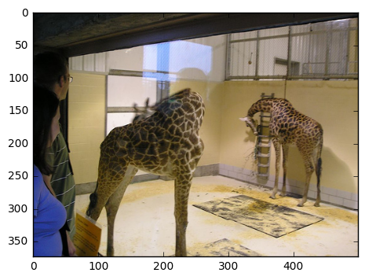

# Image Captioning
It is a detailed version of [image captioning tutorials](https://github.com/yunjey/pytorch-tutorial/tree/master/tutorials/03-advanced/image_captioning).

## evaluation

### train

| Bleu-1 | Bleu-2 | Bleu-3 | Bleu-4 | CIDEr | METEOR | ROUGE_L |
| --- | --- | --- | --- | --- | --- | --- |
| 0.567 | 0.478 | 0.429 | 0.399 | 3.669 | 0.295 | 0.551 |

### Val

| Bleu-1 | Bleu-2 | Bleu-3 | Bleu-4 | CIDEr | METEOR | ROUGE_L |
| --- | --- | --- | --- | --- | --- | --- |
| 0.328 | 0.174 | 0.099 | 0.061 | 0.585 | 0.133 | 0.298 |

## examples

    COCO_val2014_000000000073.jpg
    Generation:a motorcycle parked in a parking space next to another motorcycle
    Ground Truth:a motorcycle parked in a parking space next to another motorcycle

    COCO_val2014_000000000074.jpg
    Generation:a man laying next to a yellow fire hydrant
    Ground Truth:a picture of a dog laying on the ground

    COCO_val2014_000000000133.jpg
    Generation:a wooden <unk> bed with a white <unk> on it
    Ground Truth:a <unk> bed with a dresser underneath it

    COCO_val2014_000000000136.jpg
    Generation:two giraffes standing next to a chain <unk> fence
    Ground Truth:two giraffes in a room with people looking at them

    COCO_val2014_000000000042.jpg
    Generation:this wire metal rack holds several pairs of shoes and <unk>
    Ground Truth:this wire metal rack holds several pairs of shoes and <unk>

